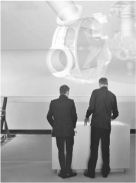
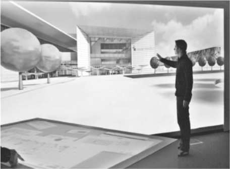
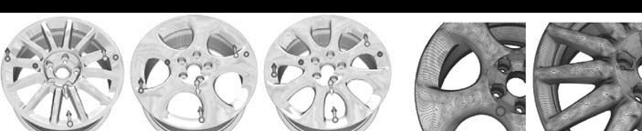
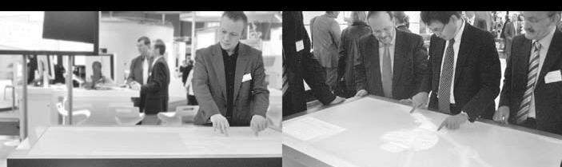
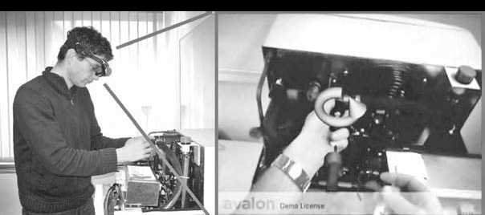
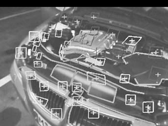
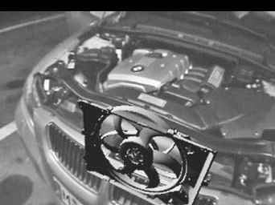
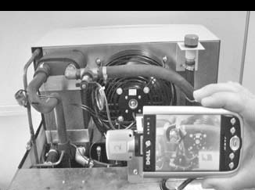

## 即时现实 —— 用于工业和增强虚拟现实的应用框架

**约翰内斯·贝尔^1，乌尔里希·博克霍尔特^1，迪特·费尔纳^1,2**

1.弗劳恩霍夫研究所，计算机图形学
2.交互式图形系统集团（GRIS），计算机科学系，达姆施塔特工业大学

### 摘要

​	随着处理能力的高速发展，显卡和移动计算机为混合现实应用开辟了广泛的领域。因此，混合现实覆盖了从使用沉浸式投影技术的虚拟现实到使用移动系统的增强现实等一系列领域，比如智能手机和超级移动个人计算机。在弗劳恩霍夫研究所，基于混合现实框架的[即时现实](www.instantreality.org)已经发展为一个供AR/VR开发人员使用的单一和一致的接口。这个框架提供了一套全面的功能，以支持传统的虚拟现实（VR）以及移动增强现实（AR），其目标是提供一个非常简单的应用程序接口，其中包括高逼真的渲染，3D用户交互和沉浸式显示技术领域的最新研究成果。该系统的设计基于各种行业标准，以促进应用程序的开发和部署。

### 关键词

X3D，语义建模，基于计算机的视觉跟踪，移动系统

### 1、即时现实VR系统

	该即时现实框架是一个高性能的混合现实（MR）框架，它提供了一套全面的功能，可以同时支持经典的虚拟现实（VR）和先进的增强现实（AR）。在此背景下，术语“混合现实”，描述了虚拟和现实世界的融合：
- 在虚拟现实场景内的用户进行实时三维数字对象进行交互（参照图1）。通过立体视觉投影系统和多峰交互设备，用户完全沉浸在虚拟世界中。

> 
>
> （图1 对机器产生的即时现实场景的切身体验）

- 增强现实（AR）描述了我们与数字信息真实环境的实时叠加。典型的增强现实系统包括移动计算装置，摄像机（捕捉用户的环境）和可视化的叠加数字信息的头戴式显示器。

  该即时现实框架一直在与业界密切合作开发，并支持多种ISO / ECMA标准，它包括高逼真的渲染，3D用户交互和总沉浸式显示技术领域的最新研究成果。在虚拟现实特别是即时现实中解决了以下问题：

#### 1.1群集和分布式渲染

  	在达姆施塔特即时现实驱动着高拟真立体投影系统HEyeWall2.0。这种拼接式显示器集成了24个（6\*4）DLP立体投影系统，从而提供了8400\*4200像素（见图2）的分辨率。
>
>
>
>
>（图2 HEyeWall2.0—拼接式立体虚拟现实显示系统）
>

​	该系统采用48台PC进行并行渲染，在应用色彩校准和几何均匀调整技术后，无边界的照片被显示出来，并且可以任意地缩放。因此，高分辨率和大范围图形的投影实现是有可能的。有了这项技术，用户可以在HEyeWall2.0上可视化他们的三维模型，草图并且进行实时处理。
​	因此，即时现实软件框架包括各种优化方法，以充分利用所有可用的硬件资源，并达到各种应用运行时特定的目标：

-	基于集群的渲染

  ​不同的先拣分/后拣分算法对于每个集群节点都实时平衡渲染的负载[1]。这种方法的规模几乎是线性的，并且没有固定的CPU/ GPU数量。该算法可以通过增加渲染节点的数目从而增加整个集群性能。

  -多分辨率的数据集

  ​即时现实能为点、网格和体积创建和管理多分辨率的数据集，这使得系统可以通过控制整体的渲染性能来达到各个应用的目标，比如最小帧速率。

#### 1.2语义建模

​	以几何造型语言(GML)研究所开发的计算机图形学和格拉茨大学知识可视化技术已经被包含在了高层语义建模过程[2]。因此,3D模型不仅包含几何基本体像点和三角形还包含着一系列的算子和参数用来描述结构和重复的形式。使用这种技术的3D模型类的样例可以通过修改特定参数来展现(见图3)。GML这种技术已经被即时现实框架所使用，而在这也恰恰使得交互设计式的应用成为一种可能。

> 
>
> （图3 使用建模的几何模型语言轮缘的不同实例）

#### 1.3有交互式多点触控的虚拟现实

​	在当今的人机界面区域，多点触控技术是一种最有趣的研究领域，但是目前为止，这项技术仅仅只是我们在电脑上工作的新技术的基础，因此，既然多点触控交互可以同时与一到两个以上的手指交互，也可以在一个多用户协作工作的场景下进行活动。多点触控技术已经被广泛的融入虚拟显示中去，并且这项技术是非常有前途的，因为它可以让人们与他们看见的东西做交互活动仅仅只靠简单的触摸。用一块典型的150*90cm的板子进行的多点触控已经发展到用它来进行3D可视化，导航与交互领域（见图4）。在这种实现方法下，投影设备已经被植入到了桌子里面。广角光学和镜像系统在桌子上的表面创建一个清晰的和高分辨率图像。一种光学触感的方法用电脑视觉技术追踪着用户的手指。多点触控设备表面的丙烯酸塑料杯红外线照亮，因为丙烯酸塑料的折射率要比空气高，所以光不逃避且进行完全的内反射，每当一个物体相对表面变得足够接近的时候，光反射完全受阻，所以光消失且完全照亮物体，这也照亮了摄像机与指尖触摸表面，从而能够	捕获手指所产生的亮斑。这个一小团东西在检测的时候能够识别图片上的亮斑从而生成一张2D的图像来显示手指的位置，它还在每一帧的图片上跟踪每一团亮斑并且给他们分配一个独一无二的id。

> 
>
> （图4 使用多点触表虚拟世界交互）

### 2.即时现实AR系统

​	计算机支持的信息和通信系统在塑造我们的工作和休息时间里起到了决定性的作用。人机交互技术不仅仅可以运用在工作上，还在大量开放式新领域有着广泛的应用。在这个背景下虚拟现实起到了非常重要的作用。运用这种技术，数字信息可以叠加在真实的环境中，AR系统拥有着一下的一些特点：
​	流动性：增强现实技术尤其适用于移动应用程序。例如，它可以用于支持在一个大型的 工厂中进行有目的的工作 (见图5)或实现游客在户外使用的信息系统。
​	实时功能性：数字信息总是实时的叠加在真实的对象身上，这就说明，增强现实系统支持虚拟和真实对象的一致性。
​	和背景的联系：信息通过在真实的物品上叠加能够实现可视化，这能够保证电脑制作的物品和真实的3D物品之间的关系是非常清楚的。
​	直观性：展示的物品主要由图像动画构成，这保证了信息能通过一种易懂独立的语言传递出来。
​	互动性：创新型的交互模式摆脱了鼠标键盘，而支持必须的可移动性和灵活性。

> 
>
> （图5 增强现实的支持服务技师）
>

#### 2.1 稳健的和无标记的追踪

​	增强现实的发展中一个很特殊的挑战就是怎样实现大量的和稳健的追踪方法。追踪系统过去常常识别和登记用户的准确位置和方向。为实现这样的方法，一个混合的无标记的追踪方法应运而生。它基于下列的资料：
​	直播电视数据流：直播的电视数据是通过一种微小的火线相机记录的，这种相机使用30HZ的频率拍照且彩色照片的大小为640*480像素。
​	惯性传感器：惯性传感器在旋转方向上记录加速度的移动方向和速率大小，还记录地球磁场的方向。这些数据通过USB接口以大约100HZ的高频传输出去。相机和传感器以及电源都放在了一个追踪盒上。记录的数据和电脑上的视屏捕捉接口相关，产生同步的视频数据流。追踪软件的输入数据还包含线性加速度，角速度，地球磁场方向。
​	追踪系统使用算法模仿人类的方向感，即使在弱光和高加速的情况下，也优先处理视觉信息。从图像中提取的特征能够让系统识别真实环境中的特征，而这些标记特征要通过点和线识别器来识别（见图6）。

（图6 无标记的使用自然特征跟踪跟踪（左：特征点和边，右：AR可视））

​	在这些已经被识别的二维图像的标记的帮助下，相机的位置在三维空间中被重构。对极几何（术语）技术以前就是做这些的。标记被设置在与以前的图像对比的地方，或者被设置在与该图像相关的真实环境的3D模型中。数字3D环境模型创造于建筑或者机器的3D CAD模型预处理阶段。惯性传感器支持这种基于图像的追踪方法，通过分析某个追踪单元的数据能够预测下个追踪单元的位置和方向。惯性传感器在没有标记的情况下也能作出预测。惯性常感器也存在问题，就是测量错误会不断积累，因为标记并不是完全准确的记录某个数据。因此，惯性传感器在基于图像的追踪算法的帮助下逐渐的向正确的数据靠近。

#### 2.2 增强现实嵌入式系统

   虚拟现实通常应用于最需要的地方，而增强现实通常应用于移动设备比如PDAs和UMPCs（见图7）。所以小规模的增强现实系统正在研发以用于支持不同的轻量级设备甚至用于嵌入式系统。因此, 呈现组件是基于 OpenGL ES标准。OpenGL ES支持在移动终端设备中的三维电脑显示图形[5]。基于这些，,研制了一种场景图 来处理3 d对象的结构化和管理。场景图是兼容的 X3D的标准。

（图7 AR-维护支持系统运行在PDA上）

### 3．结论

​	即时现实框架（Instantreality）涵盖从虚拟现实到增强现实完整领域的应用程序。因此，可用于虚拟现实应用或虚拟现实模拟的基于跟踪的计算机视觉可以与实际拍摄的环境相结合，只提两个例子。 计算机视觉和计算机动画的融合包括一致的光照模拟在增强现实应用以及色度测量，支持真实色彩渲染。该即时现实框架提供了一整套的工具和插件，以简化不同数据源的集成，以及在应用开发和部署：

-	**集成**：为最常见的数字内容创建工具（例如Maya，3DMAX）制作的插件可以使应用程序开发人员高效的整合三维数据。框架的数据输入接口，可以直接读取和处理最常见的CAD数据格式（JTOpen、Catia5、Catia4、Step、STL等）。

-	**组成**：一个特殊的运行时环境允许开发人员整合和组合来自不同来源的数据。该系统包括各种插件，使开发人员能够创建任何类型的应用程序逻辑和定义组件的性能，组件关系和组件处理单元。一个极好的事件和脚本调试程序能简化开发过程。

-	**部署**：各种服务器和中间件系统可以用于部署在多个常见的硬件平台的最终应用上。服务器和通讯服务使用标准ZeroConf机制来缓解交流安装和服务的过程。

​	系统设计包括各种行业标准，以简化开发和申请服务流程[6]：OpenGL2.0（Khronos组织），GLSL（Khronos组织），Collada（Khronos组织），CG（NVIDIA公司），X3D（ISO/IEC 19775:2004），ECMAScript（ISO/ IEC16262:2002），JAVA（Sun公司），SOAP（W3D SOAPV1.2），ZEROCONF（IETF Zeroconf WG）。所有系统组件可部署在常见的硬件平台上和以下软件平台上：Windows 2000/XP/Vista，Windows CE，Linux32，Linux64，Mac OS X，IRIX，SunOS。

### 作者 

​	**Dieter Fellner**是德国的达姆施塔特工业大学的计算机科学教授，同时担任计算机图形学的弗劳恩霍夫研究所所长（IGD）。此前他曾任职于奥地利的格拉茨技术大学担任学究，德国的布伦瑞克大学，德国的波恩大学，加拿大纽芬兰纪念大学，和丹佛的科罗拉多大学。他仍然与隶属于格拉茨科技大学，在他自己于2005年建立的计算机图形学和形象化知识学院担任要职。Dieter Fellner的研究活动过去几年中所涵盖的算法和软件架构集成建模和渲染，高效渲染和可视化的算法，生成和重建建模，虚拟和增强现实的网络基础图形方面多媒体信息系统和数字图书馆。在后场他有协调由德国研究基金会（德国资助的一项战略举措研究联合会）自1997年至2005年在计算机图形学领域，数字图书馆迪特费尔纳是世界领先的杂志的编委成员和许多国际会议的程序委员会的成员。在1997年和2003年，他是欧洲制图协会的主席。他是欧洲制图协会的一员，他在执行委员会，国际计算机协会，电气和电子工程师协会计算机学会和德国计算机协会服务，在那里他作为董事延长董事会和图形分会会长单位。此外，迪特·费尔纳是德国科学理事会，德国研究基金会，以及欧洲委员会（作为ISTAG的成员）的顾问。
​	**Johannes Behr**领导德国虚拟现实社团达姆施塔特的“虚拟和增强现实“的弗劳恩霍夫计算机图形学。他在虚拟现实，计算机图形和3D感兴趣的重点领域交互技术。他的大部分最近的工作的结果，可作为部分InstantReality框架。他拥有伍尔弗汉普顿大学的理学博士学位和达姆施塔特技术大学的博士学位。
​	**Ulrich Bockholt**是德国达姆施塔特的弗劳恩霍夫计算机图形（IGD）“虚拟和增强现实”部门的领导。他在1997年获得德国美因茨大学的数学学位并且在2003年达姆施塔特工业大学获得博士学位。自1997年以来，他始终工作在弗劳恩霍夫IGD达姆施塔特的 “虚拟和增强现实” 部门。 2004年，他已经获得达姆施塔特技术大学的博士学位。他参加过或领导过虚拟和增强现实领域一些国家和国际研究项目，如SKILLS，VIVERA和AVILUS。

著作名称：Virtual Reality & Augmented Reality in Industry
作者：Dengzhe Ma、Jürgen Gausemeier、Xiumin Fan、Michael Grafe
翻译段落原标题：Instantreality — A Framework for Industrial Augmented and Virtual Reality Applications 
翻译人：[成凯](https://lovelope.github.io)